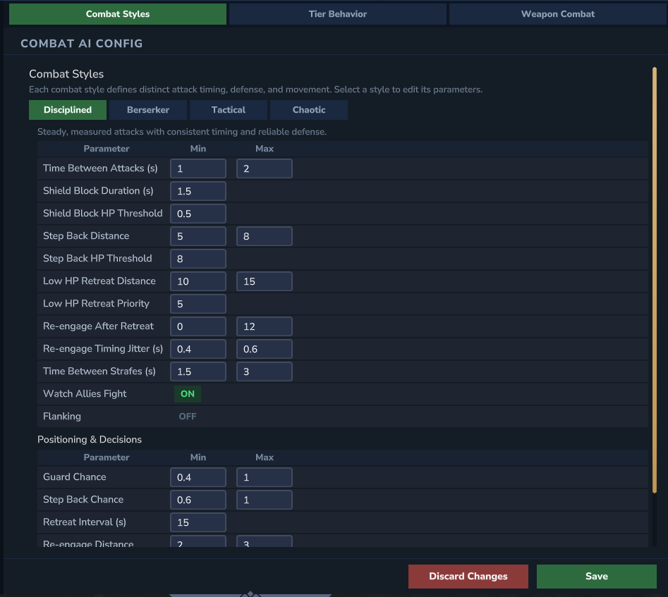
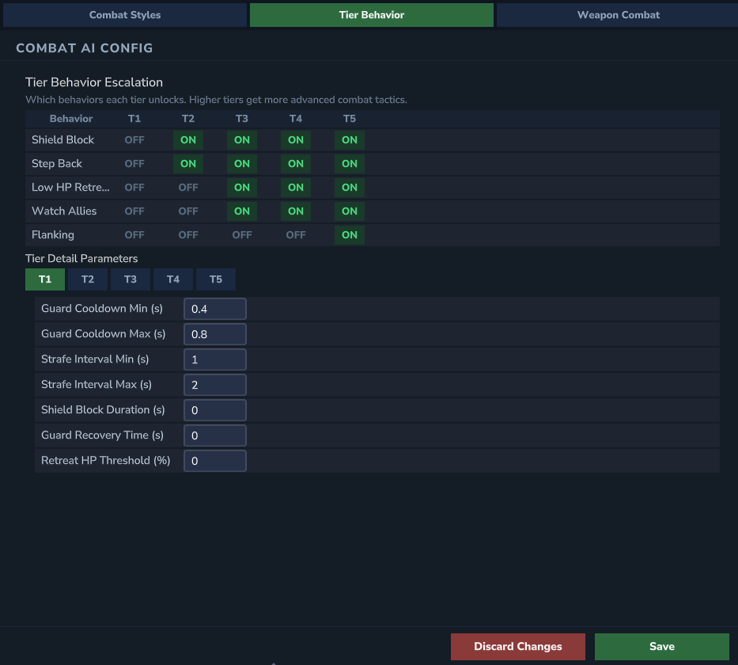
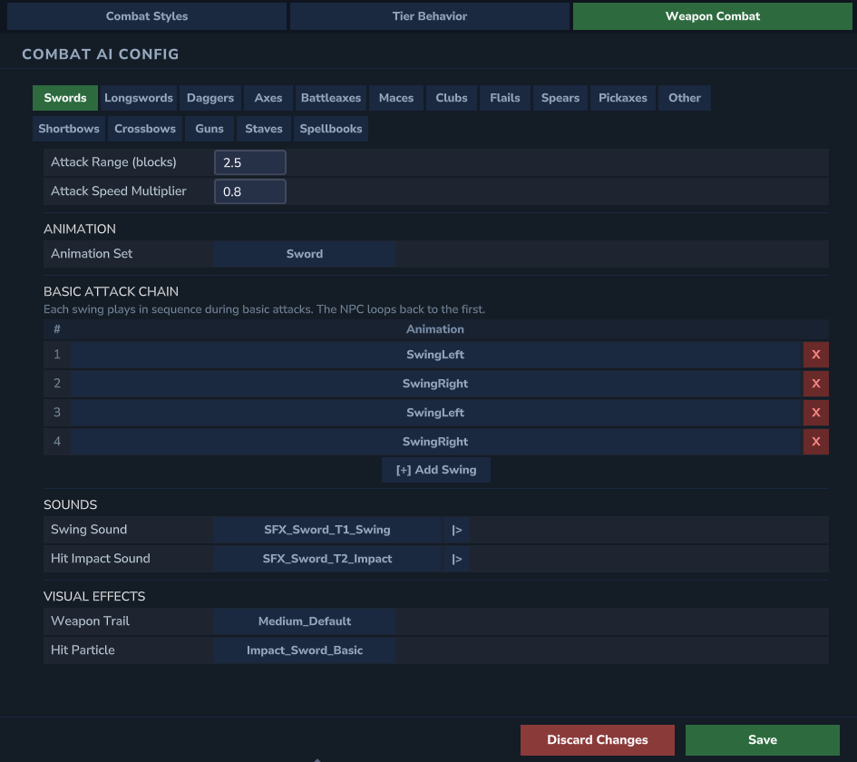
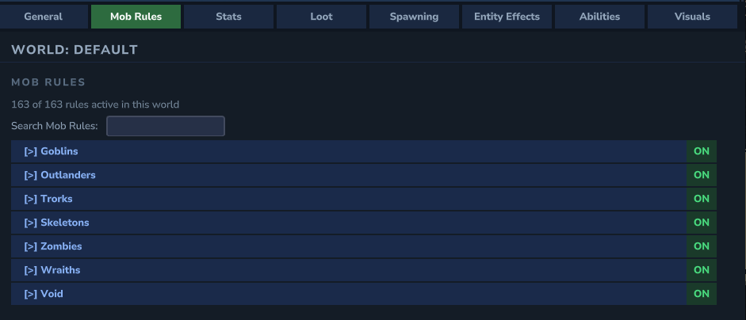
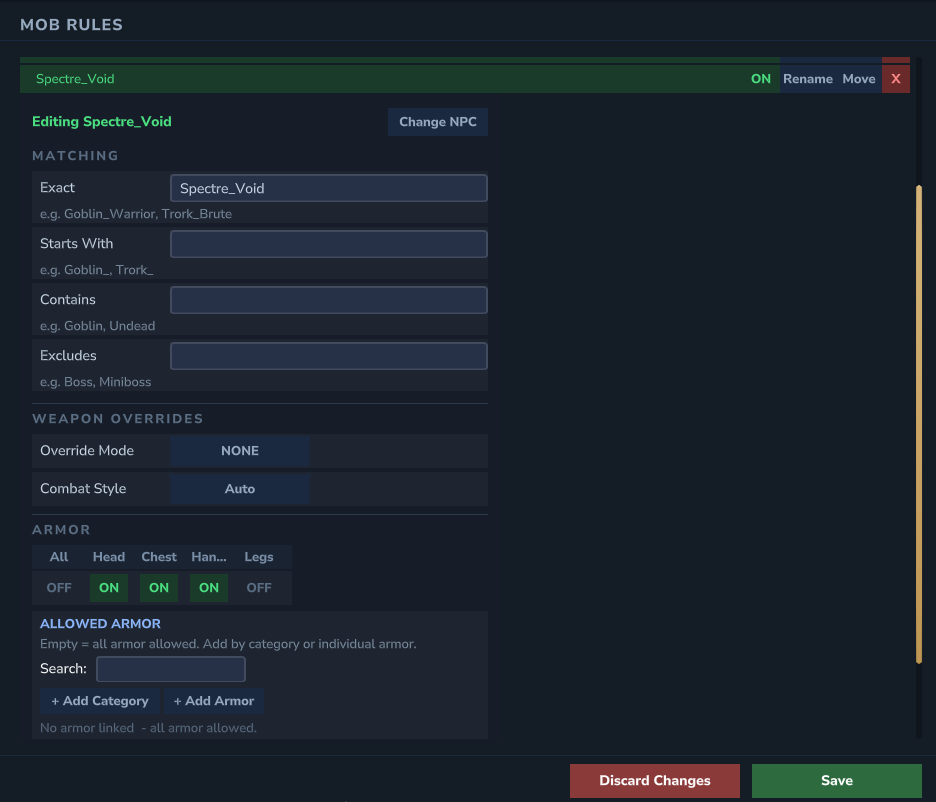

# RPGMobs

## Tiered elites that change combat, loot, and progression

RPGMobs transforms standard Hytale NPCs into tiered elites with scaling stats, combat abilities, tiered loot, and
distinct visuals. Fully configurable via YAML or the in-game Admin UI, with runtime reloads, per-world overlays,
an event-driven modding API, and support for both casual and hardcore servers.

## Downloads

<table>
<tr>
<td align="center" width="50%">

<br/><br/>
<strong>Plugin</strong>
<br/><br/>
<a href="https://www.curseforge.com/hytale/mods/rpgmobs">

</a>
</td>
<td align="center" width="50%">

<br/><br/>
<strong>API</strong>
<br/><br/>
<a href="https://www.curseforge.com/hytale/mods/rpgmobs-api">

</a>
</td>
</tr>
</table>

## Documentation

Full configuration guides, developer API reference, and troubleshooting:

[](https://docs.RPGMobs.frotty27.com/)

## Feature Highlights

### Combat

- 5 power tiers (Common to Legendary) with independent health and damage scaling
- **CAE-first combat AI** - Hytale's native CombatActionEvaluator drives movement, basic attacks, guarding, retreating, and flanking. RPGMobs generates per-weapon attack chains, per-style combat behaviors, and per-tier behavior escalation at runtime
- **4 combat styles**: Disciplined (steady timing), Berserker (fast aggression), Tactical (measured, flanking at T5), Chaotic (wide timing randomizer). Each mob rule can be assigned any style
- **Per-tier behavior escalation**: T1 basic attacks only, T2 adds shield guard and back-off, T3 adds health retreat and group observe, T4 tightens cooldowns, T5 adds flanking
- **Per-weapon attack chains** for 10 weapon types (Swords, Longswords, Daggers, Axes, Battleaxes, Maces, Clubs, ClubsFlail, Spears, Pickaxes) with correct animations and sounds
- **Per-tier movement speed** - T1 elites move 20% faster (eager rush), T5 elites move 30% slower (menacing walk-down)
- **9 combat abilities**:
  - **Charge Leap** - melee charge and slam with per-weapon sounds (8 weapon variants)
  - **Heal Leap** - heal potion toss with standing heal variant for retreat situations (living humanoids only)
  - **Undead Summon** - faction-based minion spawning with green orb hand particles
  - **Dodge Roll** - reactive dodge on player attacks, boosted chance against charged attacks. Lateral dash with dust particles and weapon trails
  - **Multi Slash Short** - 1-2 hit quick strikes, 3 random variations per weapon, all tiers
  - **Multi Slash Medium** - 2-4 hit combos, 2 variations per weapon, T2+
  - **Multi Slash Long** - 4-6 hit full combos, 1 variation per weapon, T3+
  - **Enrage** - berserk fist-fighting transformation. De-equips weapon, 20-second rapid punch chain (3 variations), exhaustion death with normal loot/XP. Outlanders, Goblins, and Trorks only, T2+
  - **Volley** - ranged projectile burst for bow/crossbow/gun wielders, T3+
- **Reactive parry system** - shield and weapon parry triggered by player attack detection. Per-weapon wind-up delay, per-tier chance (T2: 15% to T5: 70%)
- **Global ability cooldown** - 1-3 second random cooldown between abilities. Reactive abilities (dodge roll, parry) bypass this cooldown
- 48 unique combo designs across all weapon types and Multi Slash lengths
- Ability gating per mob rule with per-tier toggles and weapon category restrictions
- Per-mob armor slot restrictions for mobs whose models don't support full armor
- In-game Admin UI for live configuration (`/rpgmobs config`)

### Loot & Gear

- Category-based weapon and armor organization with hierarchical category trees
- Rarity-weighted equipment assigned by weapon and armor categories per mob rule
- Tiered loot tables with configurable drop multipliers (up to 6x for Tier 5)
- Per-tier drop enablement - control exactly which tiers can drop each item
- Loot templates with linked mob rules for targeted drop tables (e.g., Goblin Boss loot)
- Chance to drop equipped items on death with configurable durability range
- Consumable drops including food, potions, gems, and materials

### Identity

- Tiered nameplates with rank indicators and family prefixes via [NameplateBuilder](https://github.com/TimShol/hytale-nameplate-builder)
- Model scaling per tier for distinct visual presence
- Entity effects system (projectile resistance and more)
- Debug nameplate overlay showing enabled abilities, current activity, and cooldowns

### Progression

- Three progression styles: Environment (zone-based), Distance from Spawn, or Random
- Per-zone tier distribution with configurable weights
- Distance-based stat bonuses for smooth difficulty curves

### Per-World Overlays

- Per-world and per-instance-template overrides via the overlay system (`worlds/` and `instances/` directories)
- Override spawning, stats, loot, abilities, visuals, and elite behavior per world or instance
- **Global mob rules** edited in a dedicated sidebar section, with per-world enable/disable toggles
- Per-world loot templates with category tree organization
- Per-world `disabledMobRuleKeys` for selectively disabling specific mob rules in individual worlds
- Tier overrides and loot overrides for fine-grained per-mob control
- Instance worlds (`instance-{Template}-{UUID}`) are automatically matched by template name (case-insensitive)
- Two built-in presets (Full and Empty) plus custom preset save/restore
- Manage overlays visually through the Admin UI or edit YAML files directly

### Admin UI

RPGMobs includes a full in-game configuration panel accessible via `/rpgmobs config`. Every setting can be managed visually without editing YAML files.

- **Sidebar navigation** with sections for Global Core, Global Debug, Global Config, Global Mob Rules, Per-World overlays, and Per-Instance overlays
- **8 sub-tabs** per world/instance: General, Mob Rules, Stats, Loot, Spawning, Entity Effects, Abilities, Visuals
- **Combat AI tab** in Global Config with 3 sub-tabs:
  - **Combat Styles** - attack timing, retreat behavior, and group tactics per style
  - **Tier Behavior** - per-tier toggle grid with detail parameters for guard, retreat, flanking
  - **Weapon Combat** - per-weapon attack chain editor with animation set picker, swing chain builder, sound pickers with preview, trail and particle selection
- **Tree explorers** for mob rules, loot templates, abilities, and entity effects with search filtering
- **NPC picker** and **Item picker** popups for adding mob rules and loot drops
- **Asset picker popup** for sounds, animations, trails, and particles with pack name prefix (e.g., "Hytale - SFX_Sword_T1_Swing"). Sound preview plays audio on click
- **Per-world mob rule view** with ON/OFF toggles, category navigation, and summary counter
- **Global Config** tabs for managing weapon categories, armor categories, rarity rules, and tier equipment quality
- **Save & Discard** with unsaved change indicators (yellow/green markers) across all tabs












### Integrations

- Built-in RPGLeveling support with tier-scaled XP, ability-based XP bonuses, and minion XP reduction
- XP settings are overlayable per-world - each world or instance can have its own XP multipliers
- Standalone `rpgleveling.yml` config auto-generated when RPGLeveling is detected

### For Developers

- Event-driven API (v1.2.0) with 12 event types (spawn, death, damage, abilities, aggro, loot)
- Read-only Query API for inspecting any RPG mob's state, including `getMatchedMobRuleKey()`, `getActiveAbilityId()`, and `getCombatStyle()`
- Cancellable events for spawn blocking, damage modification, and loot customization
- Separate API artifact for compile-time dependency

## Quick Start

```text
1. Download RPGMobs and place the JAR in your server's mods folder
2. Start the server to generate default configuration
3. Use /rpgmobs config for the in-game Admin UI, or edit the YAML files directly
4. Run /rpgmobs reload to apply YAML changes without restarting
```

## Installation

1. Download the RPGMobs `.jar` from CurseForge.
2. Place it in your server `mods` folder.
3. Start the server to generate configuration files.
4. Configuration files are created under:

```
%APPDATA%\Hytale\UserData\Saves\<save name>\mods\RPGMobs
```

## Configuration

RPGMobs uses a layered configuration system with a base config directory, per-world overlays, and per-instance overlays.

| Path | Purpose |
|:---|:---|
| `core.yml` | Global settings: master kill switch (`globalEnabled`), enabled by default, debug mode, config format version |
| `base/core.yml` | System config: reconciliation, integrations (RPGLeveling) |
| `base/stats.yml` | Health and damage multipliers per tier |
| `base/spawning.yml` | Progression style, spawn chances, zone distributions |
| `base/gear.yml` | Equipment categories, rarity rules, armor materials |
| `base/loot.yml` | Drop rates, loot templates, extra drops |
| `base/abilities.yml` | Ability toggles, cooldowns, linked mob rules, per-tier scaling |
| `base/visuals.yml` | Nameplates, model scaling, family prefixes |
| `base/effects.yml` | Entity effects (projectile resistance, etc.) |
| `base/mobrules.yml` | Global mob rules with weapon categories, armor slots, and combat style per NPC |
| `base/combat.yml` | Combat AI settings: combat styles, tier behavior, per-weapon attack chains, parry config |
| `worlds/` | Per-world overlay YAML files (includes `disabledMobRuleKeys` for per-world mob rule control) |
| `instances/` | Per-instance-template overlay YAML files |

## Runtime Reload

```text
/rpgmobs reload
```

Reloads all YAML configuration from disk. Spawn logic updates immediately. Existing elites are reconciled on their
next tick - mob rules are re-evaluated and equipment is re-applied as needed.

## Commands

| Command | Description |
|:---|:---|
| `/rpgmobs reload` | Reloads all YAML configuration files from disk |
| `/rpgmobs config` | Opens the in-game Admin UI for visual configuration |
| `/rpgmobs spawn <role> <tier> [weaponCategory]` | Spawns an elite NPC with optional weapon category override (debug mode only) |
| `/npc clean --confirm` | Removes all Elite entities from the world |

## Permissions

| Permission | What it allows |
|:---|:---|
| `rpgmobs.reload` | Use the `/rpgmobs reload` command |
| `rpgmobs.config` | Use the `/rpgmobs config` command to open the Admin UI |
| `rpgmobs.spawn` | Use the `/rpgmobs spawn` command (debug mode only) |

## API Overview

RPGMobs ships a separate `rpgmobs-api` artifact (v1.2.0) for mod developers. Add it as a compile-time dependency to listen to
events, query RPG mob state, or modify loot and damage.

The Query API provides methods such as `getMatchedMobRuleKey()`, `getActiveAbilityId()`, and `getCombatStyle()` for
inspecting elite state at runtime.

See the [API documentation](https://docs.RPGMobs.frotty27.com/api/overview) for integration details.

## Uninstalling

If you remove the mod, leftover elite NPCs can remain with modified stats and equipment. Use:

```text
/npc clean --confirm
```

Repeat until all remaining elite NPCs are removed. Do not kill them directly as it can crash the game.

## Compatibility

RPGMobs is compatible with **Hytale Update 4**. It works alongside other Hytale mods. Nameplate rendering is handled by
[NameplateBuilder](https://github.com/TimShol/hytale-nameplate-builder), which provides the tiered nameplate
display used by RPGMobs. Mod developers looking to extend or interact with RPGMobs should use the
`rpgmobs-api` artifact - see the [API documentation](https://docs.RPGMobs.frotty27.com/api/overview) for
integration details.

[](https://github.com/TimShol/hytale-nameplate-builder)

## License

This project is licensed under the [MIT License](LICENSE).
