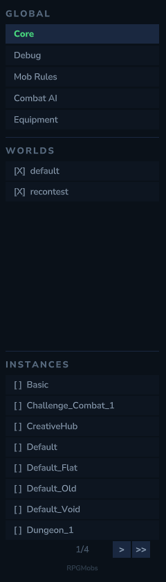

RPGMobs includes a full in-game Admin UI for managing all configuration without editing YAML files. Every setting from the 9 base config files and all per-world/instance overlays can be viewed and edited visually.

## Opening the Admin UI

```
/rpgmobs config
```

Requires the `rpgmobs.config` permission. The Admin UI opens as a full-screen panel.


## Sidebar Navigation

The left sidebar has 4 sections:

| Section | What it shows |
| :--- | :--- |
| **Global Core** | Base config settings shared across all worlds (weapon/armor categories, rarity rules) |
| **Global Debug** | Debug mode toggle and mob rule scan interval |
| **Per-World Overlays** | One entry per world — click to edit that world's overlay |
| **Per-Instance Overlays** | One entry per instance template — click to edit that instance's overlay |

Selecting a world or instance loads its overlay for editing. When you switch to a different world, your pending edits are automatically stashed and restored when you return.



## Sub-Tabs

Each world/instance overlay has 9 sub-tabs:

| Tab | Content |
| :--- | :--- |
| **General** | Enabled toggle, RPGLeveling/XP settings, Elite Behavior toggles, Preset selector |
| **Mob Rules** | Per-world mob rule tree with detail panel, NPC picker |
| **Stats** | Health and damage multipliers per tier, random variance |
| **Loot** | Loot template tree, drop rules with per-tier toggles, item picker |
| **Spawning** | Progression style, spawn chances, environment tier rules, distance bonuses |
| **Entity Effects** | Effect tree with per-tier toggles and multipliers |
| **Abilities** | Auto-discovered abilities with per-entry tier toggles |
| **Visuals** | Nameplates, model scaling, family prefixes |
| **Overrides** | Tier overrides and loot overrides per mob |

## General Tab

The General tab controls the master switches and presets for the current overlay.

- **Enabled** — master switch for RPGMobs in this world
- **RPGLeveling** — toggle XP integration, per-tier XP multipliers, ability bonus XP, minion XP reduction
- **Elite Behavior** — friendly fire prevention, fall damage immunity, elite-on-elite aggro prevention
- **Presets** — apply a built-in preset or save/restore a custom preset

### Presets

| Preset | What it does |
| :--- | :--- |
| **Full** | Enables RPGMobs with all base config values inherited. Only sets `enabled: true`. |
| **Empty** | Enables RPGMobs but zeroes everything — no spawning, no abilities, no loot, no scaling. A blank slate for building from scratch. |
| **Custom** | Save the current overlay as a custom preset. Restore it later to return to your saved configuration. |


## Mob Rules Tab

A tree explorer for managing per-world mob rules.

- **Categories** shown in blue — click to navigate into. Prefixed with `[>]`
- **Items** shown in green — click to expand the detail panel below
- **Search filter** — type to search all mob rules across all categories (flattens the tree)
- **Back/Forward** navigation history for browsing categories
- **Breadcrumb** bar showing current location in the tree

### Mob Rule Detail Panel

Clicking a mob rule item expands a detail panel:

- **Enabled** toggle
- **Match patterns** — exact, prefix, contains, and excludes lists
- **Weapon Override Mode** — cycle between ALWAYS, ONLY_IF_EMPTY, NONE
- **Per-tier weapon override** toggles (T1-T5)
- **Weapon category** links — click `[>]` to peek at category contents
- **Armor category** links
- **Change NPC** button — opens the NPC picker to rebind the rule to a different NPC

### Adding Mob Rules

Click **[+ Add Mob Rule]** to open the NPC picker. NPCs that already have mob rules are automatically excluded from the list.


## Stats Tab

Per-tier health and damage multipliers with random variance fields. Each field shows the current overlay value (or inherits from base if null).

## Loot Tab

A tree explorer for loot templates, plus scalar loot fields.

### Scalar Fields

- **Vanilla drop extra rolls** per tier
- **Equipment drop chances** (weapon, armor, off-hand)
- **Dropped gear durability** range

### Loot Template Detail Panel

Clicking a loot template expands a detail panel:

- **Linked mob rules** (paginated, 10 per page) — which mob rules trigger this template
  - **Add Category** — expands a category to individual mob rule keys
  - **Add Mob** — opens the NPC picker
- **Drop rules** (paginated, 5 per page) — each drop has:
  - Item ID (selected via Item Picker popup)
  - Drop chance
  - Min/Max quantity
  - 5 per-tier ON/OFF toggles


## Spawning Tab

- **Progression Style** — ENVIRONMENT, DISTANCE_FROM_SPAWN, or NONE
- **Spawn chances per tier** — 5 weight fields
- **Environment tier rules** — per-zone tier distributions (when using ENVIRONMENT)
- **Distance bonuses** — distance per tier, bonus intervals, health/damage bonus per interval, caps

## Entity Effects Tab

A tree explorer for entity effects (base config, not per-overlay).

Clicking an effect expands a detail panel:
- **Infinite** toggle
- **Per-tier** ON/OFF toggles (T1-T5)
- **Per-tier multipliers** (T1-T5)

## Abilities Tab

Auto-discovers all registered abilities. Each ability appears as a row with an ON/OFF toggle.

Clicking an ability expands its detail panel:
- **Linked mob rules** (paginated) — each entry shows the mob rule key with 5 per-tier ON/OFF toggles
- **Add Category** — adds all mob rules from a category
- **Add Mob** — opens the NPC picker to add an individual mob rule


## Visuals Tab

- **Nameplates** — enable toggle, mode (SIMPLE/RANKED_ROLE), per-tier enables, prefix text per tier
- **Family prefixes** — per-family name prefixes for each tier
- **Model scaling** — enable toggle, per-tier scale multipliers, variance

## Overrides Tab

Two sections:

### Tier Overrides
Force specific tiers for certain mob rules. Each entry has:
- A key (mob rule key or `category:*`)
- 5 tier toggles (which tiers are allowed)
- Expandable spawn chance weights per tier

### Loot Overrides
Force a specific loot template for a mob rule. Each entry maps a mob rule key to a loot template name.

## Save & Discard

- **Yellow markers** indicate unsaved changes (current state vs. what is on disk)
- **Green markers** indicate changes from the applied template/base
- **Save** writes ALL pending overlays (including stashed ones from other worlds), not just the active one
- **Discard** reverts to the last saved state, preserving UI navigation (tree position, expanded panels, pages)

## Global Config Tabs

When selecting **Global Core** in the sidebar, 3 sub-tabs appear:

### Weapon Categories
Manage the weapon category tree. Categories are named groups of weapon IDs (e.g., "Swords" contains all sword weapon IDs). Mob rules reference these categories using `category:CategoryName` syntax.

### Armor Categories
Same pattern as weapon categories, but for armor. Armor IDs use the `Armor_Material_Slot` format (e.g., `Armor_Iron_Head`, `Armor_Iron_Chest`).

### Rarity & Tiers
- **Gear durability** — spawn durability min/max
- **Per-tier equipment** — armor slots per tier, shield/utility chance per tier
- **Tier allowed rarities** — 5x5 ON/OFF grid (tiers vs. rarities)
- **Tier rarity weights** — expandable per-tier weight distributions
- **Two-handed keywords** — list of keywords that mark weapons as two-handed
- **Weapon/armor rarity rules** — keyword-to-rarity mappings


## Popups

### NPC Picker
Modal popup with 939 NPC role IDs. Search filter, 15 rows per page, pagination. Custom ID entry for non-standard NPCs. NPCs already used in the current context are excluded. Two-step: click to select, then confirm.

### Item Picker
Modal popup with 3,523 item IDs. Search filter, 15 rows per page with item icons, pagination. Custom ID entry. Two-step selection.

### Rename Popup
Text field for renaming tree items or categories.

### Move Popup
Breadcrumb-navigated category selector for moving items between categories. Prevents moving a category into itself or its descendants.

### Category Peek
View the contents of a category without navigating to it. Appears when clicking `[>]` on category references in ability linked mobs, loot template linked mobs, or weapon/armor category links.
