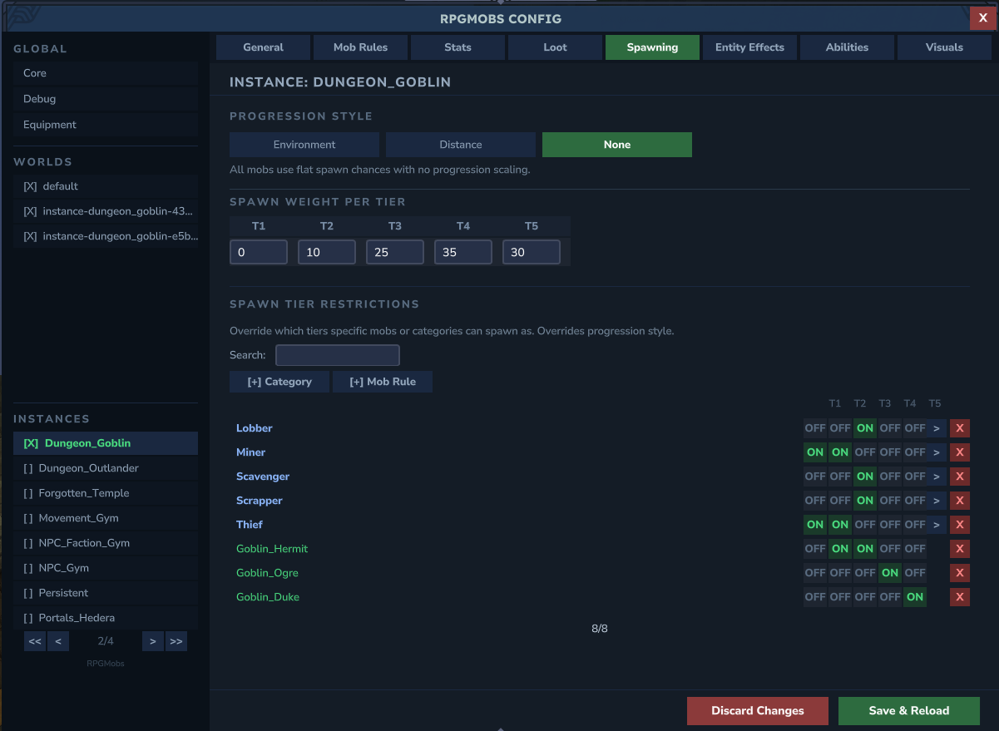

RPGMobs uses a layered overlay system for per-world customization. A shared base configuration defines defaults, and individual overlay files can selectively override any field for a specific world or instance template. Any field not set in an overlay is inherited from the base config.

## File Structure

```
RPGMobs/
  core.yml              ← Global settings (enabled by default, debug)
  base/                 ← 9 base config files (shared across all worlds)
    core.yml
    stats.yml
    spawning.yml
    gear.yml
    loot.yml
    abilities.yml
    visuals.yml
    effects.yml
    mobrules.yml
  worlds/               ← Per-world overlay files
    default.yml
    Persistent.yml
  instances/            ← Per-instance-template overlay files
    Dungeon_Goblin.yml
```

The `base/` directory holds the 9 base config files that define the defaults for all worlds. The root `core.yml` holds global settings like `enabledByDefault` and debug flags.

Per-world overlays live in `worlds/` and are matched by exact world name. Per-instance-template overlays live in `instances/` and are matched by the template portion of the instance world name.

## How Resolution Works

When a world loads, RPGMobs resolves its configuration through the following steps:

1. **Exact world match** — the world name is checked against files in `worlds/`. If a file named `{WorldName}.yml` exists, that overlay is applied on top of the base config.
2. **Instance template match** — instance worlds are named `instance-{Template}-{UUID}`. The `{Template}` portion is matched case-insensitively against files in `instances/`. For example, `instance-Dungeon_Goblin-a1b2c3d4-...` matches `instances/Dungeon_Goblin.yml`.
3. **No match, enabled by default** — if no overlay file matches and `enabledByDefault: true` is set in the root `core.yml`, the world uses the base config as-is.
4. **No match, disabled by default** — if no overlay file matches and `enabledByDefault: false`, RPGMobs is disabled for that world entirely.

Any field set to `null` or omitted in an overlay inherits from the base config.

## Creating an Overlay

Overlays can be created in two ways:

- **Admin UI (recommended)** — run `/rpgmobs config` in-game. The sidebar lists all worlds and instance templates. Select one and edit its settings visually. Changes are saved to the appropriate overlay file automatically.
- **Manual YAML** — create a `.yml` file in `worlds/` or `instances/` with the world name or template name as the filename. Only include fields you want to override.



## Overlayable Fields Reference

Every field below can be set in an overlay file. Omitted fields inherit from the base config.

### General

| Field | Type | What it does |
| :--- | :--- | :--- |
| `enabled` | boolean | Master switch for this world. `false` = no elites spawn. |

### Spawning

| Field | Type | What it does |
| :--- | :--- | :--- |
| `progressionStyle` | string | `"ENVIRONMENT"`, `"DISTANCE_FROM_SPAWN"`, or `"NONE"`. |
| `spawnChancePerTier` | double[5] | Tier spawn weight per tier (T1 through T5). |

### Distance From Spawn

These fields only apply when `progressionStyle` is `"DISTANCE_FROM_SPAWN"`.

| Field | Type | What it does |
| :--- | :--- | :--- |
| `distancePerTier` | double | Blocks per tier transition. |
| `distanceBonusInterval` | double | Block interval for applying bonus stats. |
| `distanceHealthBonusPerInterval` | float | HP bonus added per interval. |
| `distanceDamageBonusPerInterval` | float | Damage bonus added per interval. |
| `distanceHealthBonusCap` | float | Maximum health bonus from distance. |
| `distanceDamageBonusCap` | float | Maximum damage bonus from distance. |

### Stats

| Field | Type | What it does |
| :--- | :--- | :--- |
| `enableHealthScaling` | boolean | Toggle health scaling on or off. |
| `healthMultiplierPerTier` | float[5] | HP multiplier per tier (T1 through T5). |
| `healthRandomVariance` | float | Random HP offset applied to each elite. |
| `enableDamageScaling` | boolean | Toggle damage scaling on or off. |
| `damageMultiplierPerTier` | float[5] | Damage multiplier per tier (T1 through T5). |
| `damageRandomVariance` | float | Random damage offset applied to each elite. |

### Abilities

| Field | Type | What it does |
| :--- | :--- | :--- |
| `abilityOverlays` | map | Per-ability overlay. Each entry has an `enabled` flag and a list of linked mob entries, where each linked entry specifies a mob rule key and a `boolean[5]` controlling per-tier enablement. |

Example YAML structure for ability overlays:

```yaml
abilityOverlays:
  charge_leap:
    enabled: true
    linkedEntries:
      - key: "Goblin_Duke"
        enabledPerTier: [false, false, true, true, true]
      - key: "Trork_Grunt"
        enabledPerTier: [false, true, true, true, true]
```

### Loot

| Field | Type | What it does |
| :--- | :--- | :--- |
| `vanillaDroplistExtraRollsPerTier` | int[5] | Extra rolls on the vanilla drop table per tier. |
| `dropWeaponChance` | double | Chance to drop equipped weapon on death. |
| `dropArmorPieceChance` | double | Chance to drop each equipped armor piece. |
| `dropOffhandItemChance` | double | Chance to drop the off-hand item. |
| `droppedGearDurabilityMin` | double | Minimum durability for dropped gear (0.0 to 1.0). |
| `droppedGearDurabilityMax` | double | Maximum durability for dropped gear (0.0 to 1.0). |
| `defaultLootTemplate` | string | Name of the default loot template to use. |

### Elite Behavior

| Field | Type | What it does |
| :--- | :--- | :--- |
| `eliteFriendlyFireDisabled` | boolean | When `true`, elites cannot damage each other. |
| `eliteFallDamageDisabled` | boolean | When `true`, elites take no fall or environment damage. |
| `eliteNoAggroOnElite` | boolean | When `true`, elites will not target other elites. |

### Visuals

| Field | Type | What it does |
| :--- | :--- | :--- |
| `enableNameplates` | boolean | Toggle elite nameplates. |
| `nameplateMode` | string | `"SIMPLE"` or `"RANKED_ROLE"`. |
| `nameplateTierEnabled` | boolean[5] | Per-tier nameplate visibility toggle. |
| `nameplatePrefixPerTier` | string[5] | Tier indicator text per tier (e.g., `["I", "II", "III", "IV", "V"]`). |
| `tierPrefixesByFamily` | map | Family-specific prefix names (e.g., Goblin, Trork). Replaces base entirely when defined. |
| `enableModelScaling` | boolean | Toggle model size scaling. |
| `modelScalePerTier` | float[5] | Model scale multiplier per tier. |
| `modelScaleVariance` | float | Random scale offset applied to each elite. |

### XP Integration

These fields require the [RPGLeveling](https://www.curseforge.com/hytale/mods/rpgleveling) mod to be installed and enabled.

| Field | Type | What it does |
| :--- | :--- | :--- |
| `rpgLevelingEnabled` | boolean | Toggle RPGLeveling XP integration for this world. |
| `xpMultiplierPerTier` | double[5] | XP multiplier per tier. |
| `xpBonusPerAbility` | double | Bonus XP awarded per active ability on the elite. |
| `minionXPMultiplier` | double | XP multiplier for kills on summoned minions. |

### Overrides

| Field | Type | What it does |
| :--- | :--- | :--- |
| `tierOverrides` | map | Per-mob tier restrictions. Each entry specifies allowed tiers and spawn chance weights for a mob rule key. |
| `lootOverrides` | map | Per-mob loot template assignment. Each entry maps a mob rule key to a loot template name. |

### Per-World Data

| Field | Type | What it does |
| :--- | :--- | :--- |
| `mobRules` | map | Per-world mob rules that override the base `mobrules.yml`. |
| `mobRuleCategoryTree` | tree | Category hierarchy for organizing per-world mob rules. |
| `lootTemplates` | map | Per-world loot templates that override the base `loot.yml`. |
| `lootTemplateCategoryTree` | tree | Category hierarchy for organizing per-world loot templates. |

## Merge Semantics

Not all fields merge the same way when an overlay is applied on top of the base config:

- **Most fields** — the overlay value is used if non-null, otherwise the base value is inherited. This applies to all scalar fields and most arrays.
- **`environmentTierRules`** — when an overlay defines any environment tier rules, it **fully replaces** the base rules. This is not additive. If you define one environment rule in an overlay, all base environment rules are removed for that world.
- **`tierPrefixesByFamily`** — when an overlay defines any family prefixes, it **fully replaces** the base family prefixes.
- **`tierOverrides`** — **additive merge**. Overlay entries are added to or replace matching entries in the base map.
- **`lootOverrides`** — **additive merge**. Overlay entries are added to or replace matching entries in the base map.
- **`abilityOverlays`** — **additive merge**. Overlay entries are added to or replace matching entries in the base map.

## Presets

The [Admin UI](/config/admin-ui) provides two built-in presets that can be applied to any overlay:

| Preset | What it does |
| :--- | :--- |
| **Full** | Enables RPGMobs and inherits all base config values. Only sets `enabled: true`. |
| **Empty** | Enables RPGMobs but zeroes everything — no spawning, no abilities, no loot, no scaling. A blank slate for building a custom configuration from scratch. |

You can also save a **Custom** preset per overlay. This stores a snapshot of all current overlay settings that can be restored later.

## Example: Dungeon_Goblin Instance

RPGMobs ships with a pre-configured example overlay for the `Dungeon_Goblin` instance template. This demonstrates how to tailor RPGMobs for a specific dungeon experience.


The overlay file at `instances/Dungeon_Goblin.yml` configures:

```yaml
enabled: true
progressionStyle: "NONE"
spawnChancePerTier: [0, 10, 25, 35, 30]
healthMultiplierPerTier: [0.5, 1.0, 2.0, 3.5, 5.0]
damageMultiplierPerTier: [0.5, 1.0, 1.8, 2.5, 3.5]
eliteFriendlyFireDisabled: true
eliteFallDamageDisabled: true
enableNameplates: true
enableModelScaling: true
```

- **Progression set to NONE** — tiers are assigned randomly using the defined weights, since dungeons don't use zone-based or distance-based progression
- **No Tier 1 spawns** — the first weight is `0`, so all dungeon elites are at least Tier 2
- **Higher scaling** — health and damage multipliers are increased compared to the base config, making dungeon encounters harder
- **Elite behavior** — friendly fire and fall damage are disabled so elites don't accidentally kill each other in tight dungeon corridors
- **Visuals active** — nameplates and model scaling remain enabled so players can identify threat levels

You can use this as a starting point for your own dungeon or instance overlays. Open the Admin UI, select the instance in the sidebar, and adjust settings to match your desired difficulty.

## Tips

**Tip:** To disable RPGMobs in a specific world (e.g., a lobby), create an overlay with `enabled: false`. No other fields are needed.

**Tip:** To use the base config unchanged in a world, simply don't create an overlay file for it. As long as `enabledByDefault: true` is set in the root `core.yml`, unmatched worlds use the base config automatically.

**Tip:** Use the Admin UI (`/rpgmobs config`) for the easiest editing experience. It handles file creation, field validation, and dirty-change tracking automatically.
